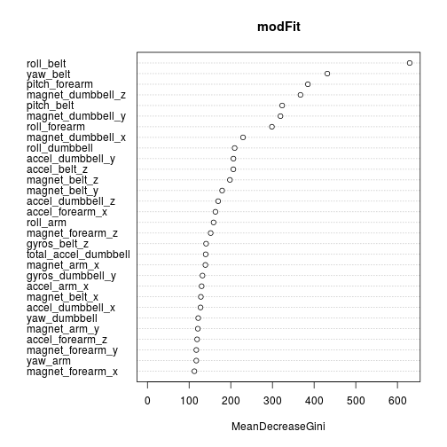
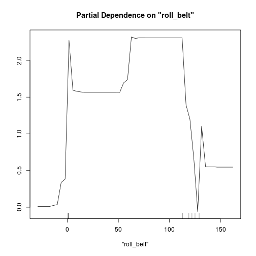
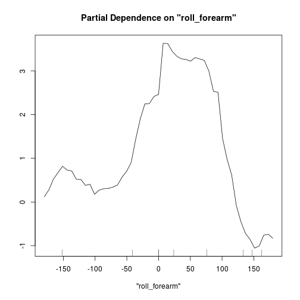
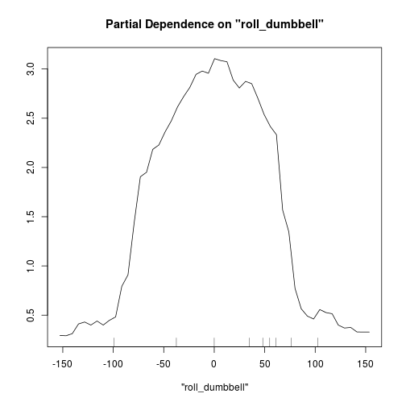

Project - Practical Machine Learning - Anton Lodder
February 21st, 2015


First we load the library and set the seed to ensure repeatability.


```r
library(caret)
set.seed(3433)
```

The training data comes in a .csv file. It is necessary to catch 
empty cells, text 'N/A' and '#DIV/0' entries using the 
na.strings option; this ensures that R can ignore these values
rather than treating them as factors.


```r
mData <- read.csv('pml-training.csv',na.strings = c("#DIV/0!", "", " ", "NA"));
```

Several columns contain only periodic reports of 
the kurtosis and skewness of specific variables. 
These columns are mostly empty or contain NA values
which we want to remove so we can build a model on just
the columns containing predictors. This next line
filters out columns that have 
a lot of elements containing 'na', eliminating the irrelevant columns.


```r
mData <- mData[, which(as.numeric(colSums(is.na(mData)))/nrow(mData) <= .90)]
```

In addition to removing the mostly empty columns, 
it is necessary to strip out metadata (index, name, window, 
timestamp etc...) that aren't predictors. These are 
contained in the first seven columns so they are easy to remove.


```r
mData <- mData[,-c(1:7)]
```

The training data-set contains
19622
elements. We want to partition the data into a training and cross-validation 
set; the training set will be used to build our classifier and the testing
set will be used to estimate our out-of-sample error.

Since there is a large number of samples, sample bias is less of a 
concern for this problem. We can get a better estimate of the out-of-sample
error by using a larger cross-validation set. I chose to split the training 
and cross-validation data into equal portions by setting p=0.5.


```r
inTrain <- createDataPartition(y=mData$classe, p=0.5, list=FALSE)

training <- mData[inTrain,]
cross_validate <- mData[-inTrain,]
```

We can run


```r
table(training[,53])
```

```
## 
##    A    B    C    D    E 
## 2790 1899 1711 1608 1804
```

to get the sample tallies for each class. There are 1500+ 
samples for each class, which means we have a large enough 
training set that we can hopefully get a properly generalized
classifier *and* a large enough cross-validation set to ensure
a good out-of-sample error estimate.

I've chosen to use the random forest model, which can be built as follows:


```r
library(randomForest)
modFit <- randomForest(training$classe ~., data=training)
```

The final model looks like this:


```r
modFit
```

```
## 
## Call:
##  randomForest(formula = training$classe ~ ., data = training) 
##                Type of random forest: classification
##                      Number of trees: 500
## No. of variables tried at each split: 7
## 
##         OOB estimate of  error rate: 0.87%
## Confusion matrix:
##      A    B    C    D    E class.error
## A 2785    4    0    0    1 0.001792115
## B   15 1876    8    0    0 0.012111638
## C    0   14 1694    3    0 0.009935710
## D    0    0   28 1578    2 0.018656716
## E    0    0    2    8 1794 0.005543237
```

The outcome of the fitting process gives an out-of-bag (OOB) 
or out-of-sample error estimate of 0.87%. This quite low, 
which is what we want.
With random forests we don't need to run cross-validation to 
reduce the variability of the error, since this process is 
embedded in the structure of a random forest classifier.

When we run prediction on the cross-validation data, we end up
with the following accuracy estimates for each class: 


```r
pred <- predict(modFit, newdata=cross_validate)

confusionMatrix(cross_validate$classe, pred)
```

```
## Confusion Matrix and Statistics
## 
##           Reference
## Prediction    A    B    C    D    E
##          A 2786    2    2    0    0
##          B    8 1886    4    0    0
##          C    0   29 1679    3    0
##          D    0    0   16 1590    2
##          E    0    0    0    7 1796
## 
## Overall Statistics
##                                           
##                Accuracy : 0.9926          
##                  95% CI : (0.9907, 0.9942)
##     No Information Rate : 0.2848          
##     P-Value [Acc > NIR] : < 2.2e-16       
##                                           
##                   Kappa : 0.9906          
##  Mcnemar's Test P-Value : NA              
## 
## Statistics by Class:
## 
##                      Class: A Class: B Class: C Class: D Class: E
## Sensitivity            0.9971   0.9838   0.9871   0.9938   0.9989
## Specificity            0.9994   0.9985   0.9961   0.9978   0.9991
## Pos Pred Value         0.9986   0.9937   0.9813   0.9888   0.9961
## Neg Pred Value         0.9989   0.9961   0.9973   0.9988   0.9998
## Prevalence             0.2848   0.1954   0.1734   0.1631   0.1833
## Detection Rate         0.2840   0.1923   0.1712   0.1621   0.1831
## Detection Prevalence   0.2844   0.1935   0.1744   0.1639   0.1838
## Balanced Accuracy      0.9983   0.9912   0.9916   0.9958   0.9990
```

All of the accuracy measures are above 99% and the average accuracy is 99.2%. This shows that we
have obtained a good performance from our model.

We can plot the variable importance values to get an idea
of which predictors have been emphasized by the random 
forest and which have been de-emphasized.


```r
varImpPlot(modFit)
```

 

This shows that the most relevant variables selected by 
our classifier are _roll_belt_ and _yaw_belt_, followed by
a number of other variables. After the first 7 variables,
the importance of subsequent variables tails off slowly, 
indicating that the information in the data-set is 
distributed fairly evenly accross the data-set.

If we use only the first 7 predictors, we can see what the 
we are gaining from having the extra variables:


```r
modFit2 <- randomForest(classe ~ roll_belt+yaw_belt+pitch_forearm+magnet_dumbbell_z+pitch_belt+magnet_dumbbell_y+roll_forearm,data=training)
modFit2
```

```
## 
## Call:
##  randomForest(formula = classe ~ roll_belt + yaw_belt + pitch_forearm +      magnet_dumbbell_z + pitch_belt + magnet_dumbbell_y + roll_forearm,      data = training) 
##                Type of random forest: classification
##                      Number of trees: 500
## No. of variables tried at each split: 2
## 
##         OOB estimate of  error rate: 2.06%
## Confusion matrix:
##      A    B    C    D    E class.error
## A 2748   17   23    2    0  0.01505376
## B   25 1830   31   11    2  0.03633491
## C    1   21 1672   16    1  0.02279369
## D    0    2   21 1583    2  0.01554726
## E    0   15    6    6 1777  0.01496674
```

```r
pred2 <-predict(modFit2, newdata=cross_validate)
conf_2<-confusionMatrix(cross_validate$classe, pred2)
conf_2$overall
```

```
##       Accuracy          Kappa  AccuracyLower  AccuracyUpper   AccuracyNull 
##      0.9798165      0.9744751      0.9768360      0.9825071      0.2834862 
## AccuracyPValue  McnemarPValue 
##      0.0000000            NaN
```

This shows that even with only the top 7 variables
it is possible to get an accurate classifier; however,
the jump from 98% to 99.2% is not insignificant, 
representing a halving of the error rate.

We can look at partial dependance plots to get a rough
idea of how classification would change for a particular
variable.


```r
partialPlot(modFit, training[,-53], x.var='roll_belt')
```

 

```r
partialPlot(modFit, training[,-53], x.var='roll_forearm')
```

 

```r
partialPlot(modFit, training[,-53], x.var='roll_dumbbell')
```

 


Finally, we can run the model on the 
test data to predict what class of 
exercise each data point might be. It is necessary to run the same 
transformations on the test data in order to ensure that the classifier
can be properly applied.


```r
test_set <- read.csv('pml-testing.csv',na.strings = c("#DIV/0!", "", " ", "NA"));
test_set <- test_set[, which(as.numeric(colSums(is.na(test_set)))/nrow(test_set) <= .9)]
testing <- test_set[,-c(1:7)]

pred_test <- predict(modFit, newdata=testing)
```

The outcomes on the test set are:


```r
pred_test
```

```
##  1  2  3  4  5  6  7  8  9 10 11 12 13 14 15 16 17 18 19 20 
##  B  A  B  A  A  E  D  B  A  A  B  C  B  A  E  E  A  B  B  B 
## Levels: A B C D E
```

